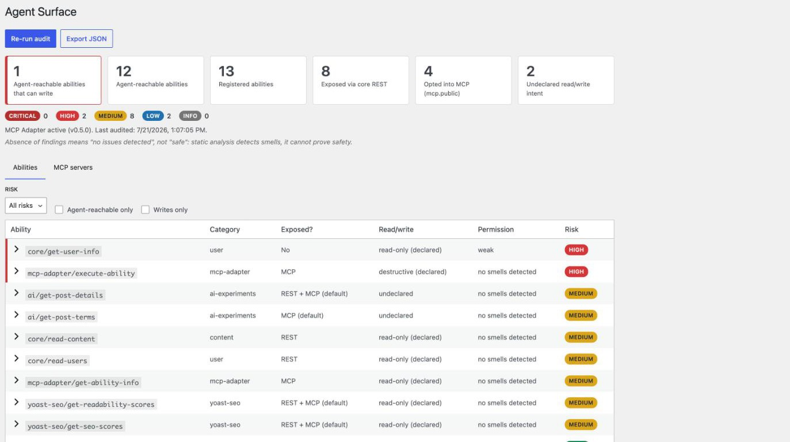
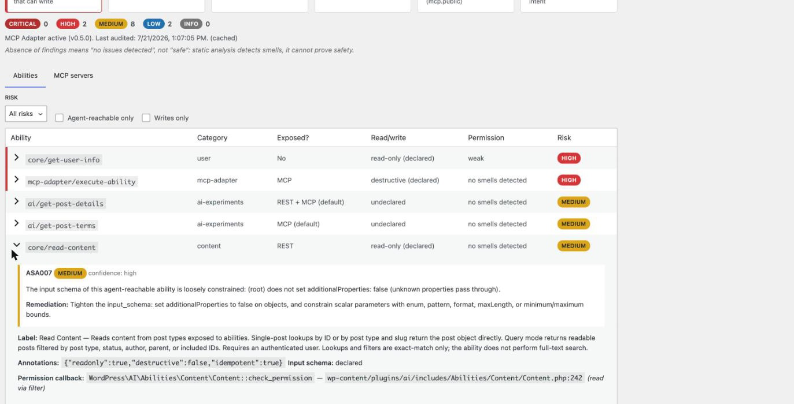
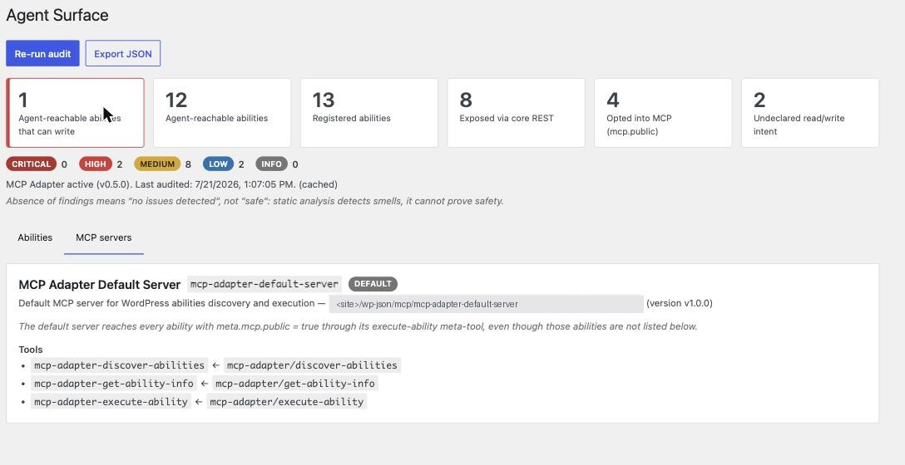

# Agent Surface Auditor

**What can an AI agent actually do to your WordPress site — and is any of it
gated properly?**

WordPress 6.9 shipped the Abilities API; the MCP Adapter exposes those
Abilities to AI agents (Claude, Cursor, ChatGPT, …). An agent authenticating
with an application password executes Abilities **as that WordPress user** —
if the user can delete posts, the agent can too. The only access control is
each Ability's `permission_callback`; annotations like `readonly` are
self-reported hints. Core ships no tooling that answers *"what am I actually
handing to agents?"*

Agent Surface Auditor is a **read-only** plugin that answers it:

- **Inventories** every registered Ability with its full descriptor.
- **Resolves exposure across both channels** — the core
  `wp-abilities/v1 …/run` REST endpoint (`meta.show_in_rest`) *and* MCP
  (the adapter's default server via `meta.mcp.public`, plus custom servers'
  explicit ability lists).
- **Evaluates a 10-rule catalog** — missing/unconditional/auth-only
  permission gates, exposed write/destructive abilities, annotation
  mismatches ("claims read-only, appears to write"), loose input schemas,
  broad capabilities on destructive ops, and more.
- **Scores and reports** — a Tools → Agent Surface dashboard and a JSON
  export for CI or diffing.



## What it surfaces

On a normal WordPress 7.0 site with Yoast SEO and the AI plugin active, the
auditor surfaces real posture facts: which abilities are agent-reachable
today, that `core/get-user-info` is gated only by authentication, and that the
MCP Adapter's own `execute-ability` meta-tool is a reachable destructive
surface.




## Safety guarantees (asserted in tests)

1. **Read-only.** It never invokes an Ability's execute or permission
   callback; the only thing it ever writes is a 5-minute report cache
   transient.
2. **Fails safe.** Analysis of a broken Ability degrades to a "could not
   analyze" finding, never a fatal.
3. **Least privilege.** The dashboard and all REST routes require
   `manage_options`.
4. **No new attack surface.** It registers no Abilities and exposes nothing
   via MCP.
5. **Honest about limits.** Static analysis detects *smells*; the report says
   "no issues detected", never "safe", and every finding carries a
   confidence tier (`high` = read from flags, `medium` = source heuristic,
   `low` = weak signal).

## Install

Requires WordPress 6.9+ (Abilities API in core) and PHP 7.4+. The MCP Adapter
is optional — without it the report shows *intended* MCP exposure from the
meta flags and says so.

```
composer install --no-dev
npm install && npm run build
```

Copy the plugin into `wp-content/plugins/agent-surface-auditor`, activate,
then open **Tools → Agent Surface**.

## REST API

All routes require `manage_options` (filter: `asa_capability`):

- `GET /wp-json/asa/v1/report` — full report (`?fresh=1` bypasses the cache)
- `GET /wp-json/asa/v1/abilities` — abilities projection
- `GET /wp-json/asa/v1/servers` — MCP server inventory + adapter state
- `GET /wp-json/asa/v1/export` — report as a download attachment

## WP-CLI & CI

The plugin registers `wp asa audit` (read-only, like everything else):

```
wp asa audit                       # human-readable summary
wp asa audit --format=table        # per-ability table
wp asa audit --format=json         # full report as JSON
wp asa audit --fresh               # bypass the cached report
wp asa audit --fail-on=high        # exit non-zero if any high+ finding exists
```

**Regression gate.** Export a baseline, commit it, then diff against it in CI —
the build fails only when a *newly appeared* finding crosses your threshold, so
pre-existing findings don't block you:

```
# once, to capture the current surface:
wp asa audit --fresh --format=json > asa-baseline.json

# in CI:
wp asa audit --baseline=asa-baseline.json --fail-on-new=high
```

The diff reports new findings, resolved findings, per-ability risk changes, and
abilities added to or removed from the surface.

## Development

Quality gates: `composer lint` · `composer check-cs` (WPCS) · `composer
phpstan` (level 10) · `composer test` (unit, no WP needed) · `composer
test-integration` (wordpress-tests-lib) · `npm run lint:js` · `npm run
lint:css` · `npm run build`.

## License

GPL-2.0-or-later.
